# How to enable vSAN File Services and create an NFS and SMB shares

The other day I was working in my home lab and needed a file share to export some files, I already have a vSAN datastore in place so I wondered why not take the opportunity to document the process of creating an NFS share in vSAN by enabling vSAN File Services, which is the capability of a vSAN cluster to provide file-level services.  

vSAN file services support the creation of file shares in NFS(v3 and v4.1) or SMB and take advantage of all the vDFS (vSAN Distributed File System) boundaries we already know and stores the file shares directly on the vSAN Cluster.

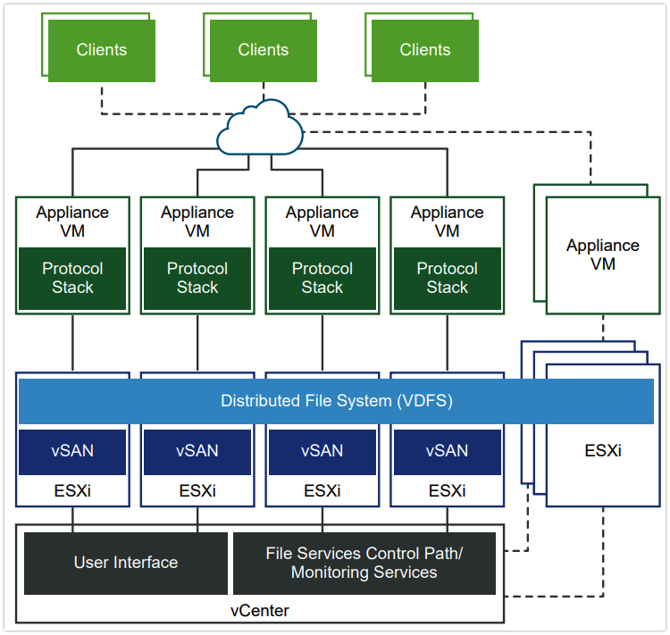

If you want to learn more about vSAN file services follow this [**link**](https://core.vmware.com/resource/vsan-file-services#section1).


##Limitations

There are some limitations that you want to be aware of, before enabling vSAN File services.

Look at them here in the official [**documentation**](https://docs.vmware.com/en/VMware-vSphere/7.0/com.vmware.vsphere.vsan.doc/GUID-97223BF9-B8D4-4B3D-985D-739F6AC4F152.html). 

## Prerequisites

The process itself is not complicated, you just have to meet some prerequisites. I'm gonna list here the most important ones for me, but for full details please check the official [**documentation**](https://docs.vmware.com/en/VMware-vSphere/7.0/com.vmware.vsphere.vsan.doc/GUID-CA9CF043-9434-454E-86E7-DCA9AD9B0C09.html).

1. Active Directory domain to use SMB or NFS 4.1 with Kerberos authentication
	1. (Optional) Active Directory Organizational Unit to create all file server computer objects.
	1. A domain user in the directory service with sufficient privileges to create and delete computer objects. 	
1. A pool of static IP addresses (The primary IP address can be used for accessing all the shares in the File Services cluster)
	1. The number of IP addresses must be equal to the number of hosts in the vSAN cluster
	1. The IP addresses must have DNS forward and reverse lookup entries
	1. All IP addresses should be in the same subnet
1. Distributed Virtual Switch 6.6.0
	1. Dedicated port group for vSAN File Services


## Enabling vSAN File Services

1. To enable vSAN File services, log in to vCenter, find the cluster in which you want to enable it, go to services, and click the "Enable" button, it will display a wizard to help you configure the service. Keep in mind that you should previously have created a dedicated port group for vSAN file services in your vDS, nothing special here just default configuration for the port group, enabling file services will enable MAC address changes and Forget transmits as part of the process .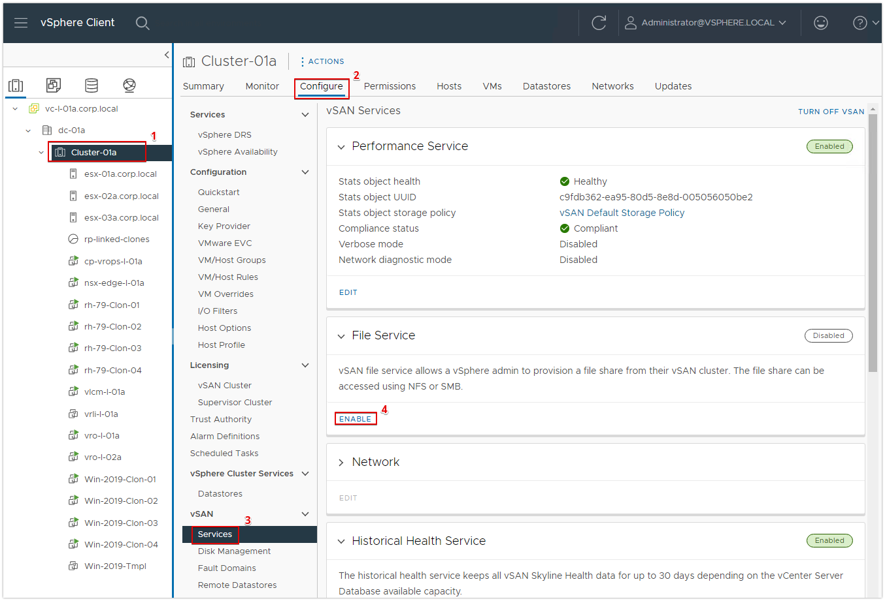

1. If your vCenter has internet access, it can automatically download the File Service Agent, if not you can manually download it from [here](https://download3.vmware.com/software/VSANOVF/FsOvfMapping.json). In my case, it will be automatically downloaded.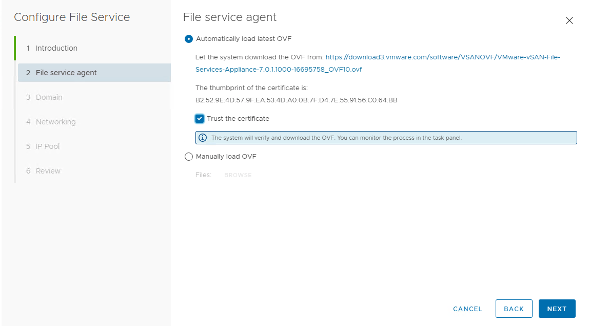

1. Fill in all your domain details, including DNS server, AD credentials, and a unique namespace for vSAN file services.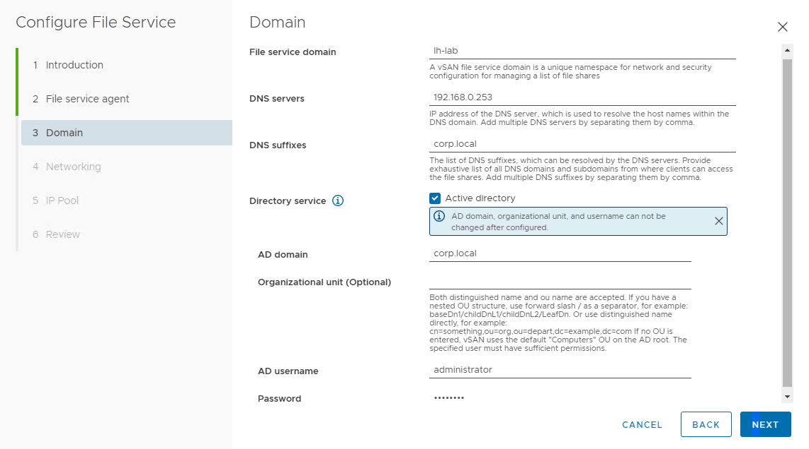

1. Select the port group you previously create and input your network information.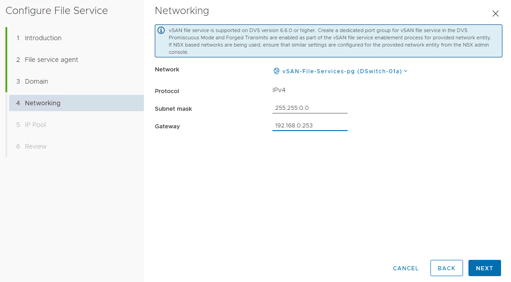

1. The IP pool section assumes you will use consecutive IP addresses, so if that is your case you can use the AUTOFILL option, this is useful for big clusters, also you can retrieve DNS entries by using LOOKUP DNS. Here you can also select the primary IP address that you will use to access the file shares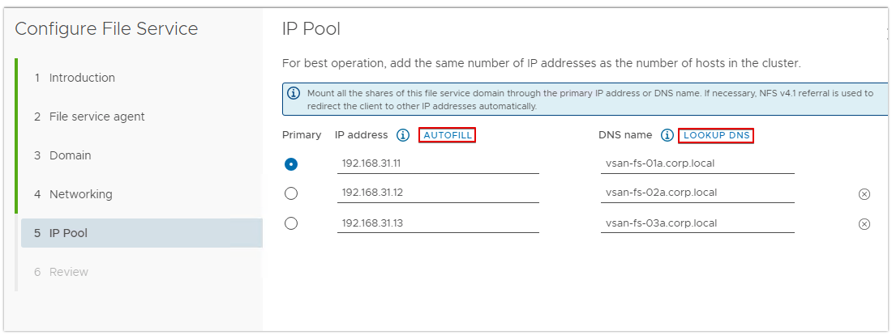

1. Check the configuration info is correct.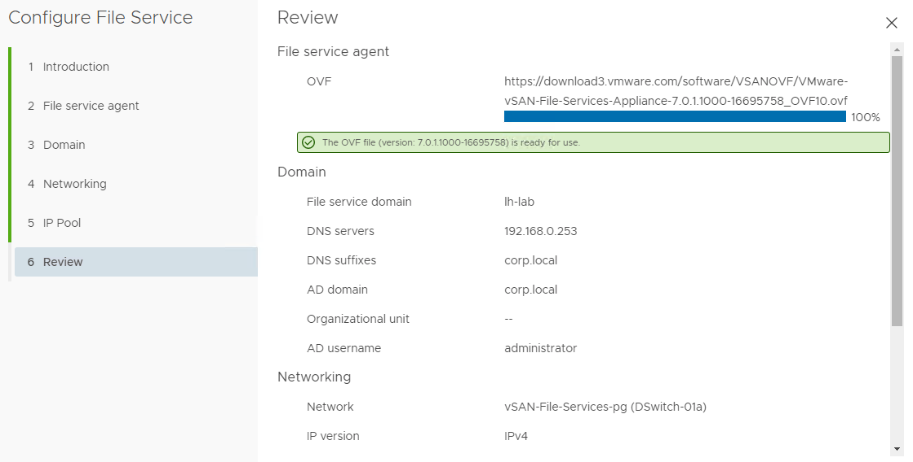

1. That's all you need to enable vSAN File Services, just check the processes running and when they finish make sure the service is enabled. There should also be some new VMs in the vCenter inventory, those VMs are the vSAN File Service Nodes, one for each ESXi host in the cluster. As you can see in the following image, the number of shares is 0, because we've just enabled it, in the following sections I'm going to create a file share and show you how to mount it on windows or Linux [image](./images/8.png)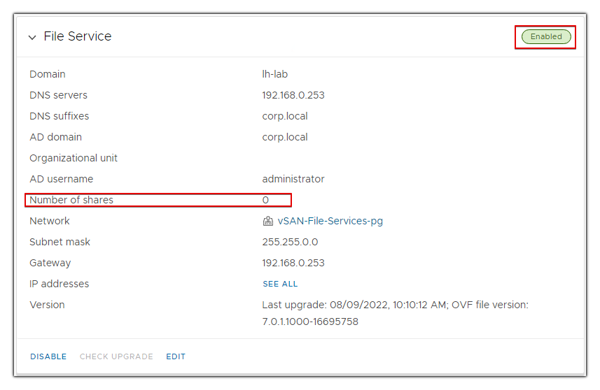

## Creating an NFS File Share

### Considerations

There are some considerations you need to have in mind when creating an NFS file share:

+ Usernames with non-ASCII characters can be used to access share data.
+ Share names can contain only English characters.
+ For Pure NFSv4 type shares, the file and directories can only contain any UTF-8 compatible.
+ For Pure NFSv3 and NFSv3+NFSv4 shares files and directories can contain only ASCII-compatible strings

To create a new file share, select the cluster with vSAN File Services enabled, go to **Configure**, under **vSAN** select **File Shares** and click on the **ADD** button.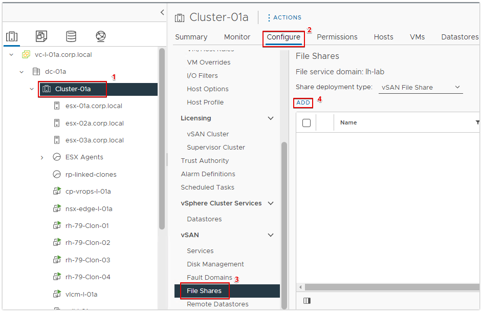

Just input a name for the file share, and specify the protocol, in this case NFS, there will be an assigned storage policy for each file share, you can use de default or create a custom storage policy.
You can set the following values regarding the storage space quotas:

+ **Share warning threshold:** When the share reaches this threshold, a warning message is displayed.
+ **Share hard quota:** When the share reaches this threshold, new block allocation is denied.

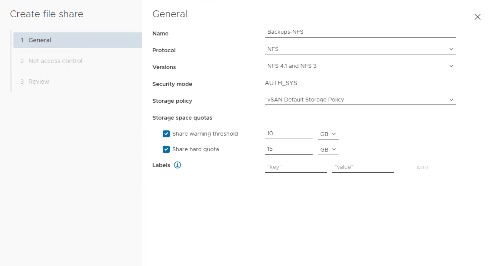

The Net Access Control section provides some options to define which IP addresses are allowed to access the NFS share, this is only available for NFS shares. I will set it to allow any IP for this example. Click **Next** review the configuration details and hit **Finish**.
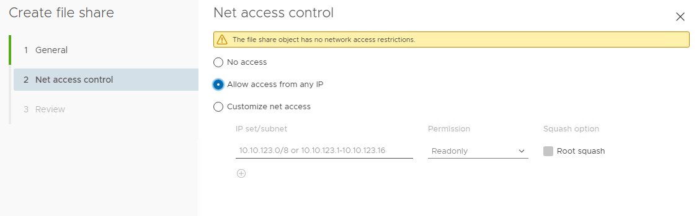

Confirm the creation of the file share.

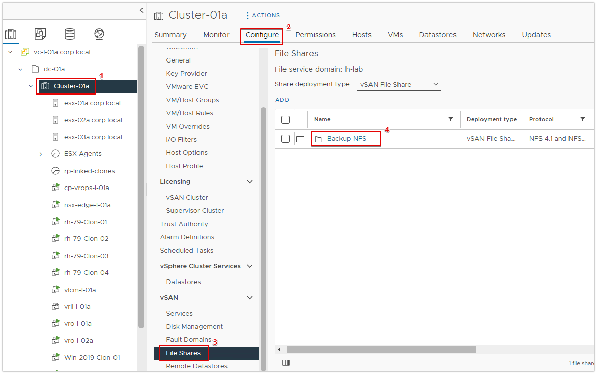

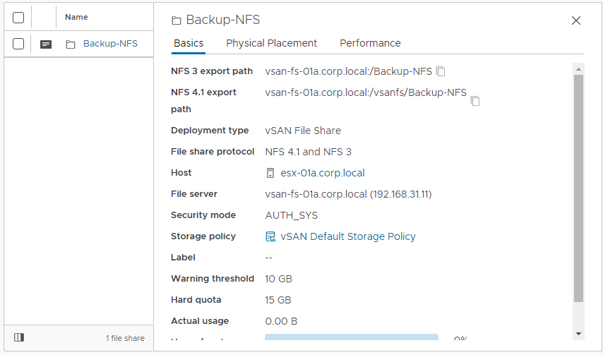

## Mounting the NFS File Share

I'm going to mount it in Linux Red Hat but it's pretty much the same in other systems.

1. Select the file share and copy the path, in this example I'm using the path for NFS 4.1. As you can see the path is pointing to the IP address we defined as **Primary** when we were enabling the service.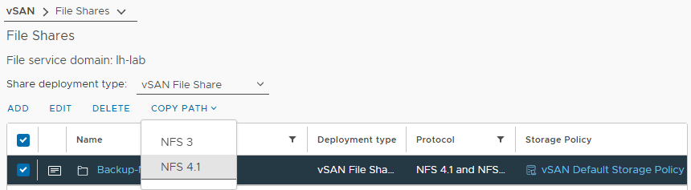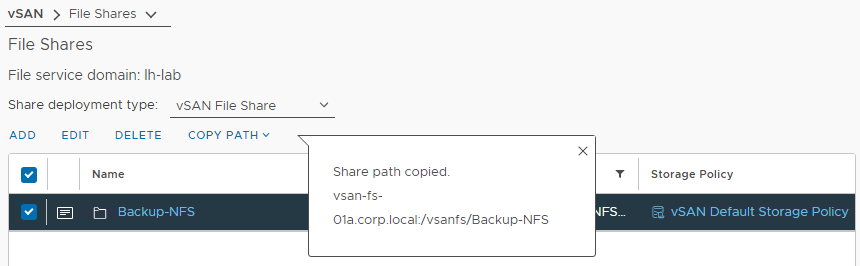
1. Create a directory to mount the NFS and mount the file share

```
mkdir /mnt/Backup-NFS
mount vsan-fs-01a.corp.local:/vsanfs/Backup-NFS /mnt/Backup-NFS/
mount -l | grep nfs 
```
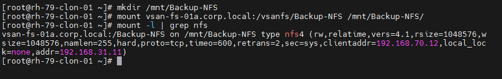

1. Test that you can create files. I will just create and read a simple text file.

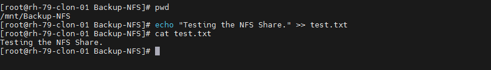


## Creating an SMB File Share

To create an SMB file share or an NFS 4.1 with Kerberos authentication, you need to make sure that you have configured vSAN File Service with AD domain credentials. We already did this as part of the enabling process of the service.

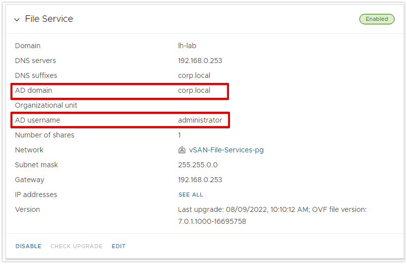

Follow the same process of creating an [Creating an NFS file share](#creating-an-nfs-file-share), but this time select SMB for the protocol. Review the configuration details and that's it.

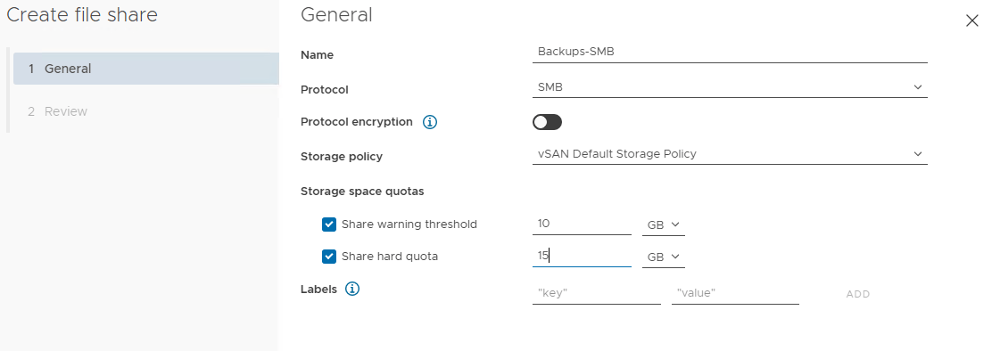

You should have your SMB share already created.

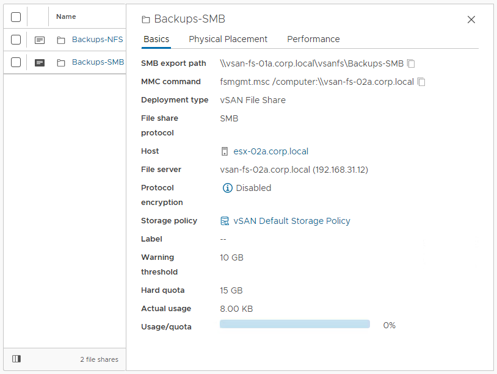


## Mounting the SMB File Share

There are two ways of mounting an SMB share on windows, via network mapping or via Microsoft Managemen Console(MMC).

### Network Mapping

1. Copy 
1. w
1. d

### MMC


1. s
1. w
1. d


1. Select the file share and copy the path, in this example I'm using the path for NFS 4.1. As you can see the path is pointing to the IP address we defined as **Primary** when we were enabling the service.
1. Create a directory to mount the NFS and mount the file share

```
mkdir /mnt/Backup-NFS
mount vsan-fs-01a.corp.local:/vsanfs/Backup-NFS /mnt/Backup-NFS/
mount -l | grep nfs 
```


1. Test that you can create files. I will just create and read a simple text file.


Contribution is not limited to software developers, since there are other ways you can help. For example, contributing towards documentation, translation, and support. Join the room on Gitter to see how you can help (see below).

If you want to help translate, then you can look at our project page on [Transifex](https://www.transifex.com/macdown/macdown/) and see whether to add a new language or complete the work of an existing language.

## Joining the Conversation

If you are new the project, then a good place to start is Gitter:

https://gitter.im/MacDownApp/macdown

Join the room, introduce yourself and find out how you can help out.

## License

MacDown is released under the terms of MIT License. For more details take a look at the [README](https://github.com/MacDownApp/macdown/blob/master/README.md).

